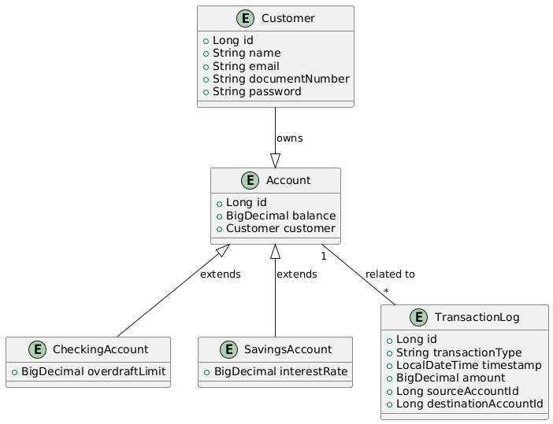
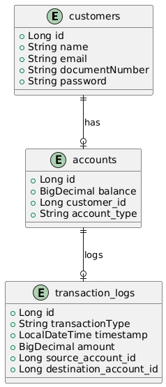
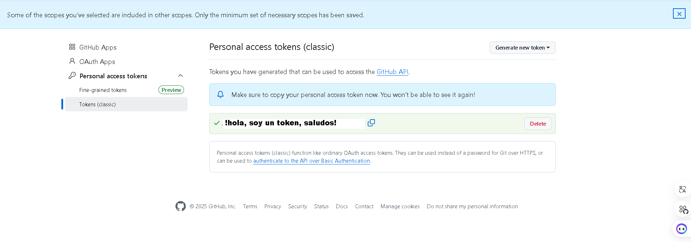
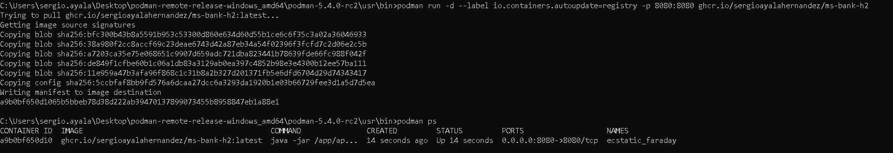
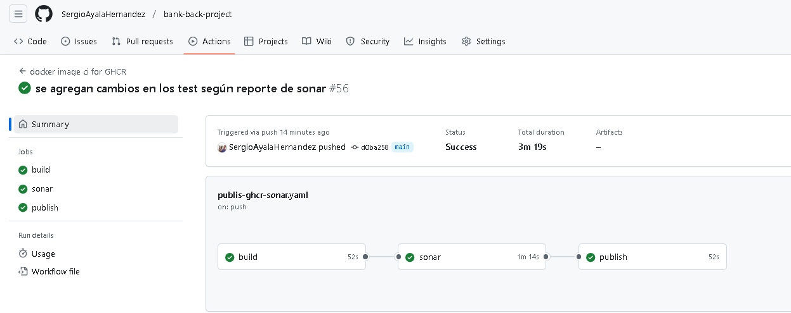
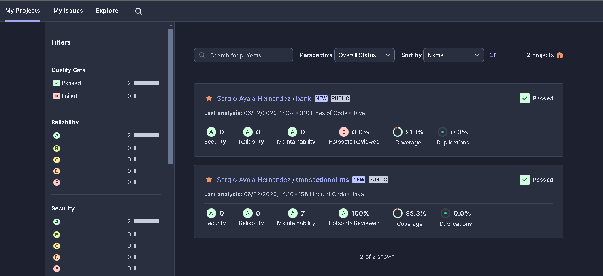

# Proyecto: Bank Manager

## Descripción

Este proyecto implementa el flujo para manejo de cuentas de ahorro y corriente, se implementan diversos patrones de diseño

## Estructura del Proyecto


```plaintext
- bank/
  - README.md              # Documentación del proyecto
  - build.gradle           # Archivo con lasdependecias necesarias
  - src/                   # Código fuente de la aplicación
    - BankApplication      # Archivo principal de la aplicación spring boot
    - utils.py             # Funciones auxiliares y utilitarias
        - config           # Configuración de seguridad de la aplicación
        - controller       # Capa de controladores para exponer servicios
        - dto              # Data Transformer object para manejo de peticiones y respuestas
        - event            # Entidad de eventos
        - exception        # Excepciones personalizadas para posibles errores
        - factory          # Patrón de diseño para la creación de cuentas bancarias 
        - mapper           # Capa de mapeo de entidades a dto con MapStruct
        - model            # Capa de entidades
        - observer         # Patrón de diseño observer para las implementaciones de las transacciones
        - repository       # Capa de repository para el manejo de datos
        - service          # Capa de servicio para manejo de lógica del negocio
        - strategy         # Patrón de diseño strategy para las transacciones
        - util             # Clase para organizar los mensajes que pueden ser reutilizados en la app
    - resources
        - application.properties # archivo de configuracion de conexión a base de datos, documentación swagger
  - tests/                 # Pruebas automatizadas
    
```

### coleción de postman

Dentro del repositorio, está una colección de postman para poder usar todos los endpoint que expone el proyecto



### MER



# API de Gestión de Cuentas

Este proyecto proporciona una API RESTful para la gestión de cuentas bancarias y la realización de transacciones entre ellas. La arquitectura del sistema sigue el patrón de diseño **Arquitectura de Capas** y utiliza el patrón **Strategy** para gestionar las transacciones. La API permite la creación de cuentas, la consulta de información de cuentas y la ejecución de transacciones de diferentes tipos (transferencias, depósitos y retiros).

## Arquitectura

La arquitectura de la aplicación se basa en una estructura en capas, donde cada capa tiene una responsabilidad específica. Las capas principales son:

- **Capa de Controladores (Controller Layer):** Proporciona los puntos finales de la API para interactuar con el sistema.
- **Capa de Servicios (Service Layer):** Contiene la lógica de negocio, como la creación de cuentas y la ejecución de transacciones.
- **Capa de Persistencia (Repository Layer):** Interactúa con la base de datos para almacenar y recuperar datos relacionados con las cuentas.
- **Capa de Observadores y Estrategias (Strategy/Observer Pattern):** Gestiona las transacciones mediante el patrón de diseño **Strategy** y notifica a los observadores cuando una transacción se completa.

## Componentes

### `AccountController`

El controlador que maneja las solicitudes HTTP relacionadas con las cuentas. Los puntos finales disponibles son:

- `POST /api/accounts`: Crea una nueva cuenta bancaria.
- `GET /api/accounts/{id}`: Recupera los detalles de una cuenta existente por su ID.
- `POST /api/accounts/transaction`: Realiza una transacción entre cuentas.

### `AccountService`

Este servicio se encarga de la lógica de negocio relacionada con las cuentas, incluyendo:

- **Creación de cuentas**: Registra una nueva cuenta asociada a un cliente.
- **Obtención de cuentas**: Recupera los detalles de una cuenta existente.
- **Ejecución de transacciones**: Realiza transferencias, depósitos o retiros, utilizando el patrón de diseño **Strategy**.

### `AccountRepository`

La interfaz del repositorio, que extiende de `JpaRepository` y permite realizar operaciones CRUD sobre las entidades `Account`.

### `AccountFactory`

El `AccountFactory` es responsable de crear instancias de `Account` basadas en el tipo de cuenta solicitado (ahorros o corriente). El patrón **Factory** se utiliza aquí para abstraer la creación de diferentes tipos de cuentas.

### `TransactionContext`

El `TransactionContext` implementa el patrón **Strategy** para ejecutar transacciones. Define el comportamiento de las transacciones (transferencias, depósitos, retiros) mediante diferentes estrategias. Además, mantiene una lista de **observadores** que se notifican cuando una transacción es completada.

### `TransactionStrategy` y sus Implementaciones

- **TransferStrategy**: Ejecuta una transferencia entre dos cuentas.
- **DepositStrategy**: Realiza un depósito en una cuenta.
- **WithdrawalStrategy**: Realiza un retiro de una cuenta.

### `TransactionObserver`

Los **observadores** son notificados después de que una transacción se ha completado. Este patrón permite que otros componentes del sistema, como el registro de transacciones, reaccionen a los eventos de transacción sin necesidad de conocer los detalles de la implementación.

## Flujo de Trabajo

1. **Creación de cuenta**: Se crea una nueva cuenta mediante el punto final `POST /api/accounts`, proporcionando un DTO con los detalles de la cuenta y la referencia al cliente.
2. **Consulta de cuenta**: Se puede consultar cualquier cuenta existente mediante el punto final `GET /api/accounts/{id}`.
3. **Transacciones**:
   - Al recibir una solicitud de transacción a través del punto final `POST /api/accounts/transaction`, el `AccountService` ejecuta el tipo de transacción adecuado utilizando el `TransactionContext`.
   - Dependiendo del tipo de transacción (`TRANSFER`, `DEPOSIT`, `WITHDRAWAL`), se selecciona una estrategia correspondiente y se ejecuta la transacción.
   - Los observadores registrados son notificados cuando la transacción se completa.

## Patrones de Diseño

### **Strategy Pattern**

El patrón **Strategy** se utiliza para encapsular los algoritmos de transacción (transferencias, depósitos y retiros). El contexto de transacción (`TransactionContext`) delega la ejecución de la transacción en las estrategias correspondientes. Esto permite añadir nuevos tipos de transacciones en el futuro sin modificar el código existente.

### **Factory Pattern**

El patrón **Factory** se utiliza en `AccountFactory` para crear instancias de diferentes tipos de cuentas (por ejemplo, cuentas de ahorros o cuentas corrientes). Esto permite que el código de creación de cuentas sea centralizado y flexible.

### **Observer Pattern**

El patrón **Observer** se utiliza para notificar a los componentes interesados cuando se completa una transacción. Por ejemplo, un observador puede ser un **TransactionLogger** que registra los eventos de transacciones.


# Configuración de la Base de Datos

La configuración de la base de datos utiliza H2, una base de datos en memoria que es ideal para desarrollo. A continuación se detallan los parámetros de configuración en `application.properties`:

```properties
spring.application.name=bank
server.port=8080

# Configuración de la base de datos H2
spring.datasource.url=jdbc:h2:mem:testdb  # Establece la URL de conexión a la base de datos en memoria
spring.datasource.driver-class-name=org.h2.Driver  # Especifica el driver de H2
spring.datasource.username=sa  # Usuario para conectarse a la base de datos
spring.datasource.password=123456  # Contraseña de la base de datos

# Configuración para la consola H2
spring.h2.console.path=/h2-console  # Habilita la consola de H2 en la URL /h2-console

# Mostrar las consultas SQL en la consola para depuración
spring.jpa.show-sql=true
```

## Acceso a la Base de Datos H2

Puedes acceder a la consola H2 de la base de datos de tu aplicación en el navegador con la siguiente URL:  
`http://localhost:8080/h2-console`

Desde la consola, puedes ejecutar consultas SQL y ver el estado de tu base de datos en memoria. No olvides ingresar la URL `jdbc:h2:mem:testdb`, el usuario `sa` y la contraseña `123456`.

---

# Habilitación de Swagger UI

Para documentar y visualizar los endpoints de tu API, usas **Springdoc OpenAPI** para habilitar Swagger. A continuación se detalla la configuración de Swagger en `application.properties`:

```properties
# Configuración para habilitar Swagger UI
springdoc.api-docs.enabled=true  # Habilita la generación de documentación de la API
springdoc.swagger-ui.enabled=true  # Habilita Swagger UI
springdoc.api-docs.path=/v3/api-docs  # URL para obtener la documentación de la API en formato JSON
springdoc.swagger-ui.path=/swagger-ui.html  # URL para acceder a la interfaz de Swagger UI
```

## Acceso a Swagger UI

Una vez que tu aplicación esté en ejecución, puedes acceder a la interfaz Swagger UI para ver y probar los endpoints de tu API a través de la siguiente URL:  
`http://localhost:8080/swagger-ui.html`

Esto te proporcionará una interfaz interactiva donde podrás ver todos los endpoints, enviar peticiones y recibir respuestas directamente desde el navegador.

---

# Configuración de Seguridad

Tu clase `SecurityConfig` proporciona una configuración de seguridad para la aplicación que incluye JWT, CSRF, autenticación, y permisos para varios endpoints. A continuación se detallan las configuraciones clave:

```java
@Configuration
@EnableMethodSecurity(securedEnabled = true)
public class SecurityConfig {

    private final JwtFilter jwtFilter;

    public SecurityConfig(JwtFilter jwtFilter) {
        this.jwtFilter = jwtFilter;
    }

    @Bean
    public SecurityFilterChain securityFilterChain(HttpSecurity http) throws Exception {
        return http
                .sessionManagement(session -> session
                        .sessionCreationPolicy(SessionCreationPolicy.STATELESS)  // Usa sesión sin estado
                )
                .authorizeHttpRequests(auth -> auth
                        .requestMatchers(HttpMethod.POST, "/api/auth/**").permitAll()  // Permite el acceso a autenticación
                        .requestMatchers("/h2-console/**").permitAll()  // Permite acceder a la consola H2
                        .requestMatchers("/error", "/favicon.ico").permitAll()  // Permite el acceso a rutas de error y favicon
                        .requestMatchers(HttpMethod.POST, "/api/customers/**").permitAll()  // Permite crear customers
                        .requestMatchers(HttpMethod.POST, "/api/accounts").permitAll()  // Permite crear cuentas
                        .anyRequest().authenticated()  // Requiere autenticación para otros endpoints
                )
                .csrf(csrf -> csrf
                        .ignoringRequestMatchers("/api/auth/**", "/api/**", "/h2-console/**")  // Desactiva CSRF para rutas específicas
                )
                .headers(headers -> headers
                        .frameOptions().disable()  // Deshabilita las opciones de marco para la consola H2
                )
                .addFilterBefore(jwtFilter, BasicAuthenticationFilter.class)  // Añade un filtro JWT para autenticar las peticiones
                .build();
    }

    @Bean
    public AuthenticationManager authenticationManager(AuthenticationConfiguration configuration) throws Exception {
        return configuration.getAuthenticationManager();  // Proporciona el AuthenticationManager para la autenticación
    }

    @Bean
    public PasswordEncoder passwordEncoder() {
        return new BCryptPasswordEncoder();  // Configura un codificador de contraseñas con BCrypt
    }
}
```

## Descripción de la Seguridad:

1. **JWT Authentication**: Se utiliza un filtro `JwtFilter` para interceptar las solicitudes y validar los tokens JWT antes de acceder a los recursos protegidos.
2. **CSRF**: El CSRF (Cross-Site Request Forgery) se desactiva en ciertas rutas como las relacionadas con la autenticación (`/api/auth/**`) y H2.
3. **Sesiones Stateless**: Se configura la aplicación para que no se mantengan sesiones del lado del servidor (modo sin estado).
4. **Autenticación**: Los endpoints definidos requieren autenticación, mientras que algunos como los de autenticación de usuarios (`/api/auth/**`) y la creación de cuentas (`/api/accounts`) están permitidos sin autenticación.

---

# Configuración Adicional en `application.properties`

A continuación, se incluyen algunos parámetros adicionales que has configurado en el archivo `application.properties`:

```properties
# Configuración de la aplicación
spring.application.name=bank  # Nombre de la aplicación
server.port=8080  # Puerto en el que la aplicación se ejecutará

# Configuración de la base de datos H2 (como se describió previamente)
spring.datasource.url=jdbc:h2:mem:testdb
spring.datasource.driver-class-name=org.h2.Driver
spring.datasource.username=sa
spring.datasource.password=123456

# Configuración de Spring JPA
spring.jpa.show-sql=true  # Muestra las consultas SQL
```


## Tecnologías Utilizadas

- **Spring Boot**: Para construir y ejecutar la API REST.
- **Spring Data JPA**: Para la interacción con la base de datos.
- **ModelMapper**: Para la conversión entre objetos de entidad y DTO.
- **H2 Database**: Base de datos en memoria utilizada para pruebas.
- **Java 17**: Versión de Java utilizada para el desarrollo.

## Endpoints de la API

### `POST /api/accounts`

Crea una nueva cuenta bancaria.

**Request body:**
```json
{
  "customerId": 1,
  "type": "SAVINGS",
  "balance": 1000.00
}
```

### `GET /api/accounts/{id}`

Obtiene los detalles de una cuenta bancaria por su ID.

```json
{
"id": 1,
"customerId": 1,
"type": "SAVINGS",
"balance": 1000.00
}
```

### `POST /api/accounts/transaction`
Realiza una transacción entre cuentas.

```json
{
  "transactionType": "TRANSFER",
  "sourceAccountId": 1,
  "destinationAccountId": 2,
  "amount": 500.00
}

```

# Proceso de Creación del Package

## 1. Creación del Token de Acceso

Para autenticar el acceso al GitHub Container Registry (GHCR), generamos un token de acceso.



---
## 2. Creación del Archivo Dockerfile

El archivo `Dockerfile` se encarga de construir la imagen de nuestro proyecto.

```dockerfile
# Primera etapa: Construcción del proyecto con Gradle
FROM gradle:8.5-jdk17 AS build
WORKDIR /app
COPY --chown=gradle:gradle . .
RUN gradle clean build -x test

# Segunda etapa: Creación de la imagen final con OpenJDK
FROM openjdk:17-jdk
WORKDIR /app
COPY --from=build /app/build/libs/*.jar /app/app.jar
EXPOSE 8080
CMD ["java", "-jar", "/app/app.jar"]
```

---
## 3. Autenticación en GitHub Container Registry

Antes de poder subir la imagen, es necesario autenticarse en `ghcr.io`.

```bash
docker login --username '***************' --'password' '***************' ghcr.io
```

Si la autenticación es exitosa, se mostrará el mensaje:
```
Authenticate to a registry
```

---
## 4. Construcción y Publicación de la Imagen Docker

### 4.1 Construcción de la imagen Docker
```bash
docker build . -t ghcr.io/sergioayalahernandez/ms-bank-h2:latest
```

### 4.2 Subida de la imagen al repositorio
```bash
docker push ghcr.io/sergioayalahernandez/ms-bank-h2:latest
```

### 4.3 Ejecución de la imagen en Podman
```bash
podman run -d --label io.containers.autoupdate=registry -p 8080:8080 ghcr.io/'***************'/ms-bank-h2
```



---
## 5. Configuración de GitHub Actions

Para automatizar la construcción y despliegue de la imagen Docker, configuramos un workflow en `.github/workflows/docker-image.yml`.

### Archivo YAML del Pipeline

```yaml
# Docker Image CI for GHCR

   Este pipeline está diseñado para realizar la integración continua de una imagen Docker y subirla a GitHub Container Registry (GHCR).

## Descripción de los pasos del pipeline

### 1. Disparadores del pipeline
El pipeline se activa en dos situaciones:
   - **Push a la rama `main`**: Esto ocurre cuando se hace un push a la rama principal.
   - **Pull request a la rama `main`**: Esto ocurre cuando se crea o actualiza un pull request dirigido a la rama `main`.

### 2. Job: `build`
   Este trabajo compila el proyecto y prepara el entorno para la construcción.

#### 2.1. `actions/checkout@v4`
- **Descripción**: Clona el repositorio en el entorno de ejecución.
- **Opciones**:
     - `fetch-depth: 0`: Esto asegura que todo el historial de commits se obtenga en lugar de solo el último commit.

#### 2.2. `actions/setup-java@v4`
- **Descripción**: Configura JDK 17 para el entorno de ejecución.
- **Opciones**:
     - `java-version: 17`: Especifica que se utilizará JDK 17.
     - `distribution: 'zulu'`: Utiliza la distribución Zulu de OpenJDK.

#### 2.3. `actions/cache@v4` (Gradle)
- **Descripción**: Crea un cache para las dependencias de Gradle para acelerar las ejecuciones posteriores.
- **Opciones**:
     - `path: ~/.gradle/caches`: Especifica la ruta del cache de Gradle.
     - `key: ${{ runner.os }}-gradle-${{ hashFiles('**/*.gradle') }}`: Define la clave del cache basada en el sistema operativo y en los archivos `gradle`.
     - `restore-keys: ${{ runner.os }}-gradle`: Restaura las claves de cache para el sistema operativo.

#### 2.4. `chmod +x gradlew`
- **Descripción**: Asigna permisos de ejecución al script `gradlew` (el wrapper de Gradle).

#### 2.5. `./gradlew build --continue --info`
- **Descripción**: Construye el proyecto utilizando Gradle.
- **Opciones**:
     - `--continue`: Continúa la compilación a pesar de los errores.
     - `--info`: Proporciona más información de la compilación.

### 3. Job: `sonar`
   Este trabajo se encarga de realizar un análisis estático del código utilizando SonarQube después de la construcción del proyecto.

#### 3.1. `actions/checkout@v4`
- **Descripción**: Clona nuevamente el repositorio para obtener el código más actualizado.

#### 3.2. `actions/setup-java@v4`
- **Descripción**: Configura JDK 17 para el entorno de análisis.

#### 3.3. `actions/cache@v4` (SonarQube)
- **Descripción**: Crea un cache para los paquetes de SonarQube para acelerar las ejecuciones posteriores.
- **Opciones**:
     - `path: ~/.sonar/cache`: Ruta del cache de SonarQube.
     - `key: ${{ runner.os }}-sonar`: Define la clave del cache.
     - `restore-keys: ${{ runner.os }}-sonar`: Restaura las claves de cache.

#### 3.4. `actions/cache@v4` (Gradle)
- **Descripción**: Vuelve a crear el cache para las dependencias de Gradle.

#### 3.5. `chmod +x gradlew`
- **Descripción**: Asigna permisos de ejecución al script `gradlew`.

#### 3.6. `./gradlew build sonar --continue --info`
- **Descripción**: Ejecuta la construcción y el análisis con SonarQube.
- **Variables de entorno**:
                 - `SONAR_TOKEN`: Token de autenticación para SonarQube.
- **Opciones**:
     - `-Dsonar.coverage.includes`: Especifica las rutas de los archivos de prueba a incluir en el análisis.
     - `-Dsonar.sources`: Ruta de los archivos fuente a analizar.
     - `-Dsonar.tests`: Ruta de los archivos de prueba.
     - `-Dsonar.exclusions`: Especifica las rutas de los archivos a excluir del análisis.

### 4. Job: `publish`
   Este trabajo se encarga de construir y subir la imagen Docker a GitHub Container Registry (GHCR).

#### 4.1. `actions/checkout@v4`
- **Descripción**: Clona nuevamente el repositorio para obtener el código más actualizado.

#### 4.2. `docker/setup-buildx-action@v2`
- **Descripción**: Configura `docker buildx` para construir imágenes Docker de manera avanzada.

#### 4.3. `docker/login-action@v2`
- **Descripción**: Inicia sesión en GitHub Container Registry para poder subir la imagen Docker.
- **Opciones**:
     - `registry: ghcr.io`: Especifica que la autenticación será para GHCR.
     - `username: ${{ github.actor }}`: Utiliza el nombre de usuario del autor del commit.
     - `password: ${{ secrets.TOKEN_GH }}`: Utiliza el token de autenticación guardado en los secretos.

#### 4.4. `Get version from Gradle`
- **Descripción**: Obtiene la versión del proyecto desde el archivo `build.gradle`.
- **Comandos**:
     - Extrae la versión del archivo `build.gradle` y la guarda en una variable de entorno.

#### 4.5. `docker/build-push-action@v4`
- **Descripción**: Construye y sube la imagen Docker.
- **Opciones**:
     - `context: .`: Establece el contexto de construcción en el directorio actual.
     - `push: true`: Sube la imagen al registro.
     - `tags: ghcr.io/sergioayalahernandez/ms-bank-h2:${{ env.VERSION }}`: Etiqueta la imagen con la versión obtenida de Gradle.
     - `build-args: |`: Establece los argumentos de construcción.
           - `PORT=8080`: Especifica el puerto a usar en el contenedor.

### Resumen:
   Este pipeline realiza la construcción, análisis con SonarQube y publicación de una imagen Docker en GitHub Container Registry. Utiliza Gradle para la construcción, configura Java JDK 17, crea caches para mejorar el tiempo de ejecución y realiza análisis de código con SonarQube para verificar la calidad del código antes de construir la imagen Docker y subirla a GHCR.

```



---
## 6. Integración con SonarCloud

Para el análisis de calidad del código, usamos SonarCloud:

1. Ingresamos con nuestra cuenta de GitHub en [SonarCloud](https://sonarcloud.io/).
2. Creamos una organización y adjuntamos los proyectos.
3. Generamos el `SONAR_TOKEN` para cada proyecto.
4. Configuramos para que el análisis no se ejecute en cada pull request.
5. Desde GitHub Actions, ejecutamos el análisis con el token generado.
6. Visualizamos el reporte de calidad en SonarCloud.



## 7.integración con podman

Se crea un archivo podman-compose yml, el cuál nos asegura el despliegue de los packages:

```yaml
version: "3"
services:
  ms-bank-h2:
    image: ghcr.io/sergioayalahernandez/ms-bank-h2:latest
    ports:
      - "8080:8080"
    network_mode: host
    container_name: sofka-bank-back-h2

  ms2-bank-reactive:
    image: ghcr.io/sergioayalahernandez/ms2-bank-reactive:v.1.1.9
    ports:
      - "8081:8081"
    network_mode: host
    container_name: sofka-bank-back-reactive

  sofka-bank-front:
    image: ghcr.io/johanquimbayo/sofka-u-bank-front:latest
    ports:
      - "3000:3000"
    network_mode: host
    container_name: sofka-bank-front
```

# Licencia SIAH

Copyright (c) [2024] [Sergio Ismael Ayala Hernandez]
